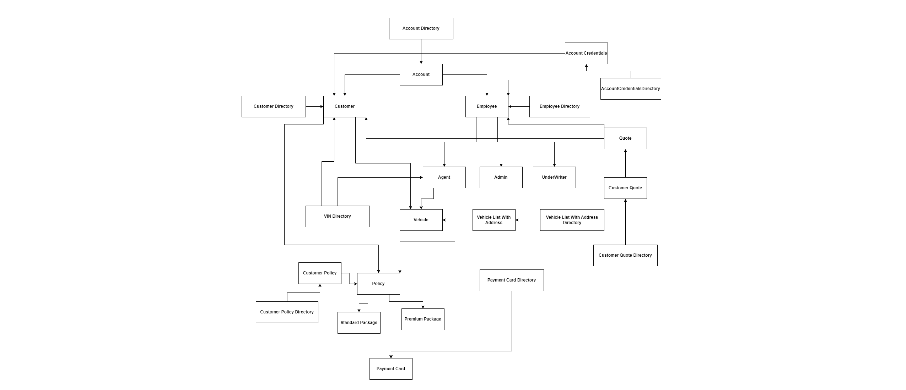

# Boston Auto Insurance

## Project Overview

The Boston Auto Insurance project is designed to streamline the process of creating and managing auto insurance policies. By leveraging Java Swing for the user interface and integrating with Talend and MS SQL for backend operations, the project significantly improves the efficiency of policy creation, data validation, and renewal processes. The system also integrates third-party verification services to ensure the accuracy and reliability of customer information.

## Problem Definition and Solution

### Challenges:
1. **Time-Consuming Policy Creation:** Traditional, visit-based policy creation is inefficient and inconvenient.
2. **Inefficient Agent Management:** Lacks a robust system for managing agents and their roles.
3. **Manual Data Entry:** Prone to errors and delays, particularly in populating vehicle information.
4. **Verification Challenges:** Ensuring the accuracy of customer information is difficult.
5. **Rigid Renewal Processes:** Limited flexibility for agents in managing policy renewals.
6. **Static Rating Systems:** Rating systems do not adapt to individual customer needs.

### Solutions:
1. **Seamless Online Policy Creation:** Allows users to create policies online, improving user experience and accelerating policy issuance.
2. **Robust Agent Management:** Implements an admin system to create and manage agent logins with specific roles, enhancing operational efficiency.
3. **Automated Data Entry with POLK Integration:** Automates vehicle data population, reducing errors and speeding up the process.
4. **Enhanced Verification System:** Uses third-party services like VINAudit and VerifySyncBilling for VIN and payment verification, ensuring data accuracy.
5. **Flexible Policy Renewal:** Grants agents the authority to renew issued and expired policies, simplifying the renewal process.
6. **Dynamic Rating Worksheet:** Adapts to customer preferences, providing accurate and personalized policy ratings.

## Technologies Used

- **Java Swing:** Developed the user interface for policy creation and management.
- **Talend:** Used for data integration, optimizing data flows between various components.
- **MS SQL:** Backend database for storing and managing policy, customer, and vehicle information.
- **Third-Party Services:** Integrated with VINAudit for VIN verification and VerifySyncBilling for payment validation.

## Key Features

- **Automated Data Validation:** The Java Swing interface includes automated data validation, which reduces policy creation time by 50%.
- **Third-Party Integration:** Integrated with services like VINAudit and VerifySyncBilling to ensure accurate data entry and verification.
- **Optimized Data Flows:** Utilized Talend for efficient data processing and MS SQL for robust data storage.

## Project Structure

### User Interface (Java Swing)
- **Policy Creation:** Allows users to input data and create policies online.
- **Data Validation:** Ensures that all entered data is accurate and verified through third-party services.
- **Policy Renewal:** Agents can easily renew existing policies.

### Backend (Talend & MS SQL)
- **Data Integration:** Talend handles data flows between the user interface and the database, ensuring seamless data integration.
- **Database Management:** MS SQL stores all relevant data, including customer, vehicle, and policy information.

### Third-Party Verification
- **VINAudit Integration:** Automatically verifies Vehicle Identification Numbers (VINs) during policy creation.
- **VerifySyncBilling:** Validates billing information to ensure payment accuracy.

## UML and ER Diagrams

- **UML Diagram:** Detailed design of the system architecture.

- **ER Diagram:** Visual representation of the database schema, illustrating the relationships between different entities in the system.

## How to Run the Project

1. **Set Up Environment:**
   - Install Java, Talend, and MS SQL on your machine.

2. **Run the Application:**
   - Open the Java Swing application to start creating and managing insurance policies.

3. **Database Setup:**
   - Use the provided SQL scripts to set up the necessary tables in MS SQL.

4. **Data Integration:**
   - Configure Talend to handle data flows between the application and the database.

5. **Verification Setup:**
   - Integrate with VINAudit and VerifySyncBilling for real-time data verification.

## Conclusion

The Boston Auto Insurance project addresses key challenges in the insurance industry by automating policy creation, enhancing data validation, and optimizing policy management processes. With a focus on efficiency and accuracy, the system provides a seamless experience for both users and agents, ensuring that all policies are created and managed with the highest standards of reliability.
